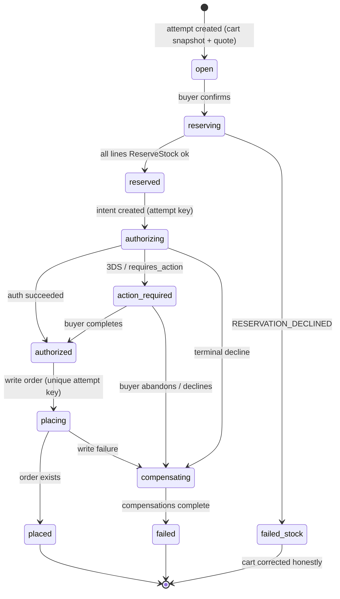

# DOF Commerce Foundation — CHECKOUT_STATE_MACHINE

**Status:** Blueprint for Founder Review · v1.0 · 2026-07-25 · The CheckoutAttempt saga of ADR-007 §4 (A7-2), fully specified: steps, compensations, idempotency, and the hostile-world test matrix.

---

## 1. Shape of the journey (buyer's view)

One page, four moves, no account wall:

1. **Who & where** — contact (email) + delivery capture (address, or nothing for digital/service/pickup). Guest-first: the `dof_visitor` identity is already minted; email is for the order, not an account. A signed-in buyer sees fields pre-filled.
2. **How it ships** — resolved methods per line (kind × buyer choice, ADR-006 dials); shipping rate quoted via `ShippingQuoteQuery`.
3. **How you pay** — Stripe hosted fields (SAQ-A: card data never touches DOF).
4. **Review & confirm** — the frozen quote: lines, offers applied (with the EffectivePriceService trace as honest "why this price"), shipping, tax, total. One button.

Confirmation page + email follow instantly on `placed` (A7-8: the *merchant* hears nothing until `confirmed`).

## 2. Saga states (the attempt's step ledger)

TTLs: attempt TTL ≤ reservation TTL (K3, proposed 15 min, Operations-clamped). Expiry from any non-terminal state → `compensating`.

## 3. Step contract (each step: idempotent, compensable, resumable)

| Step | Call | Idempotency | Compensation (K2) |
|---|---|---|---|
| Quote freeze | Commerce snapshot + TaxPort.estimate + ShippingQuoteQuery | pure reads, versioned | none needed |
| Reserve | `ReserveStock` per line | by `orderLineId` (CDC-001: retry returns original) | `ReleaseReservation` per acquired line |
| Authorize | `PaymentPort.authorize(attemptKey, totals, method)` | one intent per attempt key (P4) | void authorization |
| Place | insert Order + timeline | unique index on attempt key | void auth + release (order absent = nothing to undo) |
| (post-place) Confirm | `CommitReservation` per line | by reservation id | see §5 — the race answer |

Failure in step N runs compensations N-1…1 **in reverse**, records each in the attempt's step ledger, and lands in `failed` with a typed reason the UI renders honestly. A new attempt (new key) may start immediately from the intact cart.

## 4. The hostile-world matrix (technical review, answered)

| Scenario | What happens | Why it's safe |
|---|---|---|
| Double-click "Pay" | second submit carries the same attempt key → same intent, same order | P4 + unique(attempt key); at most one order in the universe (A7-2) |
| Browser refresh mid-checkout | attempt key persisted client-side (per-cart draft idiom) + server attempt readable → UI resumes at the step ledger's state | attempts are resumable by design (K1) |
| Two tabs, same cart | both mint attempts? No — one *active* attempt per cart; the second tab adopts it (server answers with the open attempt) | cart-scoped attempt uniqueness |
| Network dies after authorize, before place | attempt is `authorized`; retry resumes at `placing` with same key | step ledger + resumability |
| Buyer walks away after reserving | TTL expiry → `operations.reservation.expired` consumed → attempt compensates; cart intact | K3; CDC-001 lifecycle |
| Session/cookie expires mid-checkout (guest) | `dof_visitor` is 1y httpOnly; attempt continues; if truly lost, TTL cleans up and cart re-quotes on next visit | identity outlives the attempt |
| Last unit, two buyers | both reserve? No — one gets `RESERVATION_DECLINED{available}` at reserve; if expiry interleaves, the loser learns at commit (§5) | binding check is the reservation, not the availability read |
| Stripe webhook arrives before the sync response | facts keyed by intent; per-intent ordering; the attempt reads intent state, not raw webhooks | ADR-008 §6 ingestion design |
| Price changes between cart and checkout | quote freeze is the truth shown at review; cart re-quotes on read before that honestly (C2) | quote is snapshotted at attempt start, shown, then frozen into the order |
| Duplicate webhook / consumer redeploy | event-id delivery ledger | idempotent by law |

## 5. The commit race (the one designed race)

`placed → confirmed` runs `CommitReservation` per line. If Operations answers `RESERVATION_EXPIRED` (the buyer took too long and someone else claimed the last unit):

1. Orders attempts **one silent re-reserve + commit** (usually succeeds — expiry without contention).
2. If declined: the **honest re-offer** (A7-5) — the buyer is told *which line* fell through, offered the alternative (wait for restock / remove line / cancel whole order), and nothing is charged for undelivered certainty (capture-on-fulfillment makes this free). Never silent theft, never silent cancellation.

## 6. Contract tests before UI (the law of this document)

The saga ships with a storm harness before any page exists: concurrent attempts on one cart, replayed steps, kill-at-every-step compensation audits, TTL races, and the flash-sale profile (many attempts, few units). Pass bar: **zero double-orders, zero orphaned reservations, zero unexplained failures** across all interleavings. These tests are the increment's definition of done (IMPLEMENTATION_ROADMAP C3).
