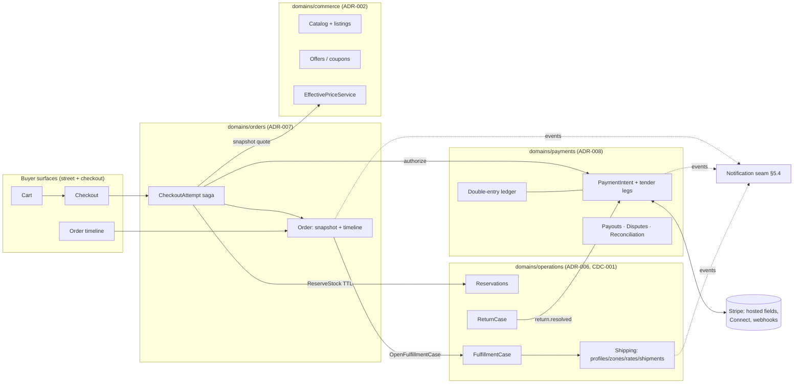

# DOF Commerce Foundation — COMMERCE_ARCHITECTURE

**Status:** Blueprint for Founder Review · **Version:** 1.0 · **Date:** 2026-07-25
**Authors:** Principal Commerce Architect (one pen)
**Authority:** This blueprint CONFORMS to the frozen corpus — ADR-001…ADR-008, CDC-001, BLUEPRINT-003, OPS-001B, the Constitution, both Bibles, DESIGN-SYSTEM-001, DECISIONS.md. Where those documents decided, this blueprint cites and does not re-decide. Where they delegated, this blueprint decides and says so. **No code exists yet under this blueprint; nothing here is implemented until Founder approval.**

---

## 1. Mission

Commerce is where DOF's promise becomes enforceable: a buyer gives money to a stranger because the platform makes the promise trustworthy. The foundation must make **every failure mode boring** — double-clicks, dead networks, webhook storms, last-unit races, refund disputes — so that what merchants and buyers experience is only the story: *I bought it, it came, it was right.*

The goal is not checkout. The goal is that in year five, no commerce feature requires a redesign — because the money model, the promise model, and the stock model were right in year one.

## 2. What is already decided (conformance table)

This blueprint invents nothing that the constitutional corpus already settled:

| Decision | Authority | One line |
|---|---|---|
| Order = immutable promise record + append-only timeline | ADR-007 A7-1 | Reality appends, never edits |
| Checkout = compensating saga on one attempt key | ADR-007 A7-2 | At most one order per attempt in all interleavings |
| Carts hold no reservations | ADR-007 A7-3 | Stock claimed only at checkout, TTL-bound |
| Reservation commands & lifecycle | CDC-001 §2.2 (frozen) | `ReserveStock/ReleaseReservation/CommitReservation`, idempotent by order line |
| Last-unit race → honest re-offer | ADR-007 A7-5, CDC-001 | `RESERVATION_EXPIRED` at commit; never silent theft |
| PaymentPort: authorize / capture / refund | ADR-007 §6, ADR-008 R-1 | Capture-on-fulfillment default; sandbox adapter from day one |
| PSP moves money; Payments owns money truth | ADR-008 A8-1 | Double-entry append-only ledger; balances are cached sums |
| Marketplace money structure from day one | ADR-008 A8-2 | Connected accounts, fee legs, payout sweeps |
| Tenders are legs; v1 = one card leg | ADR-008 A8-3 | Gift cards/store credit = future liability legs, zero redesign |
| PCI SAQ-A structurally | ADR-008 A8-4 | Hosted fields; no PAN field exists to fill |
| Escrow = ledger balance state gated by trust ladder | ADR-008 A8-5, ADR-001 §10 | A policy branch on an existing posting |
| Inventory/shipping/fulfillment/returns execution | ADR-006, BLUEPRINT-003 | Operations owns physical truth; Orders requests, observes |
| Discounts/offers substrate & effective price | ADR-002 §7 | `EffectivePriceService` with explanation trace; Deals/Coupons build on Offers |
| Taxes: Commerce stores only settings refs | ADR-002 §7 | Calculation is "Payments/Orders territory" — **closed by this blueprint, §5.3** |
| Merchants see certainty, not noise | ADR-007 A7-8 | New-order task at `confirmed`, never `placed` |
| Buyer gate class | ADR-007 A7-7 | Order-scoped, masking, guest tokens; CRM is a future read model |
| No AI-initiated financial action, ever | ADR-008 A8-10 | R3 at every autonomy setting |

## 3. Domain map



Module layout (house pattern, extraction seams): `domains/orders/{cart,checkout,order,shared-kernel}` with the D-22 quartet (`orders_domain_events`, outbox, delivery ledger, audit); `domains/payments/{intent,ledger,refund,payout,dispute,reconciliation,providers}` likewise; Operations modules already exist per ADR-006. **No domain imports another; all touch is ports + events** (contract purity, ADR-003 §9 — Payments is built for extraction).

## 4. Per-domain design

Each domain's full design lives in its dedicated document; this section is the responsibility ledger.

### 4.1 Orders (cart · checkout · order)
- **Mission:** buyer intent becoming a kept promise (ADR-007 §1).
- **Aggregates:** Cart, CheckoutAttempt, Order (roots per ADR-007 §4).
- **Ownership:** carts, attempts, orders, timelines, cancellation decisions, notification *triggers*, buyer order history, guest lookup, merchant needs-action + buyer timeline read models.
- **Boundaries:** snapshots products/prices *from* Commerce; claims stock *through* CDC-001; moves money *through* PaymentPort; requests fulfillment/returns from Operations and observes events.
- **APIs (public):** buyer cart CRUD, checkout begin/advance/confirm, order lookup (auth + guest token), cancellation request, return initiation. **Internal:** none — other domains consume Orders events, never call it.
- **Permissions:** buyer gate (order-scoped, masking, guest-token single-order); merchant actions behind the existing triple gate; `orders.view/decide` capability class for staff.
- **Failure/recovery:** every saga step names its compensation (CHECKOUT_STATE_MACHINE.md §4); late/duplicate facts idempotent by event id; timeline rebuilds from events.
- **Audit:** every command audited with actor; every externally caused transition cites its evidence event id in the timeline (O3).
- **Targets:** placement p99 < 2.5s end-to-end (reserve+authorize+write); order reads p99 < 200ms; zero double-orders under storm (contract-tested).

### 4.2 Payments (intent · ledger · refund · payout · dispute · reconciliation)
As frozen in ADR-008; Stripe specifics in PAYMENT_LIFECYCLE.md. Sole caller of money movement is Orders via the port. Targets: authorize p99 < 3s (provider-bound, timeout-budgeted, fail-closed); webhook ingestion p99 < 500ms to fact-recorded; ledger recompute gate (`check:ledger`) green forever; reconciliation discrepancy count = loud, zero silently aged > 72h.

### 4.3 Operations (reservation · fulfillment · shipping · returns)
As frozen in ADR-006/CDC-001. This blueprint adds only *consumer expectations*: reservation TTL clamp window (proposed 15 min, clamped 5–30), `ShippingQuoteQuery` shape (SHIPPING_ARCHITECTURE.md §5), and return-window policy default (30 days, merchant-configurable, generosity-biased per RT1).

### 4.4 Commerce (catalog · offers · effective price)
Already implemented through the catalog + deals surface. Commerce's checkout obligations: the **quote query** (variant identity, title, options, unit price, applicable offer, currency — served by `EffectivePriceService` with its explanation trace) must be fail-closed and versioned; coupon codes are code-bearing Offers (COMMERCE_CAPABILITY_MAP.md §Discounts) — no new domain.

## 5. Decisions this blueprint closes (the delegated set)

**5.1 Cart identity rides the visitor identity that already exists.** The guest cart key is the `dof_visitor` cookie (uuidv7, httpOnly, 1y) — the same identity that already carries fires/saves/follows and corner claims. Authenticated carts key by user id. **Merge on login = line-union, buyer-visible, re-quoted** (quantities max, never summed — refresh-safety), executed by the same claim idiom as `restoreVisitorId`/identity_claims. One active cart per (buyer, store) — C1 invariant; multi-device continuity is server-side cart state, free.

**5.2 Cart persistence & expiry.** Server-side rows from first add (no localStorage carts — multi-device continuity and merge demand it). `updated_at` is the abandonment clock; 30 days quiet → `orders.cart.abandoned` (frozen event, feeds future recovery) and the cart is archivable; prices are display hints re-quoted on read (C2) so staleness is honesty, not corruption.

**5.3 Taxes enter through a TaxPort, and DOF stays out of tax compliance.** `TaxPort.estimate(quote, destination)` at cart/checkout; `TaxPort.finalize(orderSnapshot)` at placement (tax lines become part of the immutable snapshot — ADR-007 already reserved `tax lines (future)` in LineSnapshot). v1 adapter: **merchant-configured settings** (tax-inclusive prices — the EU/street default — or a single flat rate), which is honest for DOF's launch merchants. The second adapter is **Stripe Tax** behind the same port (registration thresholds, jurisdiction math) — a config change, not a redesign. Commerce stores only the settings reference (ADR-002 conformed).

**5.4 Notifications are a seam, not a domain (yet).** ADR-007 fixed the split: Orders decides *what to say when* (triggers); delivery belongs to Notification. This blueprint ships a thin `platform/notifications` module: consumes the event taxonomy, renders merchant-language templates, sends through a `MailPort` (provider adapter; sandbox = file/log transport under the media-sandbox idiom). The customer/merchant matrix lives in DOMAIN_EVENTS.md §5. It is deliberately **not** a domain — no aggregates, no decisions — so a future Notification domain can absorb it without migration.

**5.5 Stripe is PSP #1, integrated as Connect from day one.** Selection criteria (ADR-008 rec. 2) — connected-account capability, hosted fields (SAQ-A), Payment Intents with manual capture, application fees, Stripe Tax adjacency — are all first-class. Destination charges with application fees map 1:1 to the frozen ledger legs. Exit criteria recorded: if Stripe terms/coverage fail DOF, the adapter registry + router (A8-1/A8-2) make PSP #2 an adapter, not a migration.

## 6. Cross-cutting: the idempotency spine

One chain, end to end (nothing else is trusted):

```
cart line (natural key) → checkout attempt key (client-minted uuid, survives refresh)
  → ReserveStock by orderLineId (CDC-001)
  → PaymentIntent by attempt key (P4: one intent per attempt, forever)
  → Stripe idempotency key per operation (derived: attemptKey:op:n)
  → order by attempt key (unique index — the last gate)
  → webhook facts by provider event id (delivery ledger)
```

Browser refresh, double-click, concurrent tabs, network partition, webhook replay, consumer redeploy — every storm converges to the same single order. This is contract-tested before any UI exists (CHECKOUT_STATE_MACHINE.md §6).

## 7. Failure modes & recovery strategy (summary; details per doc)

| Failure | Behavior | Recovery |
|---|---|---|
| Reserve declines (out of stock) | typed `RESERVATION_DECLINED{available}` | honest cart line correction, buyer chooses |
| Authorize fails | compensations: release reservations | retry window under same attempt key; honest copy, nothing charged |
| Place fails after authorize | void authorization, release | attempt resumable; support-visible saga state |
| Commit meets `RESERVATION_EXPIRED` | re-reserve or honest re-offer | ADR-007 A7-5 journey; never silent cancellation |
| Webhook storm/duplicates | event-id ledger; per-intent ordering | idempotent convergence |
| Stripe outage | fail-closed checkout, honest buyer copy | monitored; router seam for PSP #2 |
| Reconciliation drift | loud discrepancy records | human reversing postings only (A8-8) |
| Buyer vanishes mid-checkout | attempt TTL ≤ reservation TTL | TTL expiry releases stock; cart intact |

## 8. Audit strategy

Inherited house law, extended: every command audited with actor (buyer/guest/merchant/system); the order timeline **is** an audit surface buyers can read; ledger entries cite cause facts; reconciliation corrections are human reversing postings; refund bounds enforced in two domains independently (O4 twin P2). Money data behind finance-grade permission (`finance.payments.view`); PII masked per D-26; guest tokens single-order-scoped and rate-limited.

## 9. Scalability posture (100 → 10k → 1M merchants)

- **100 merchants (launch):** the modular monolith as-is; embedded-PG dev parity; one Stripe account with Connect; every table already partitioned-ready (orders by placement month, ledger by month).
- **10k merchants:** read models absorb list/history load; webhook fan-in parallel across intents, ordered per intent; reservation contention is per-item rows (Operations' design); Payments extracts second (ADR-003 §9) if compliance or load demands — contract purity already paid for.
- **1M merchants:** region-pinning by merchant region (ADR-006 A6-5) with buyer reads replicated; per-region PSP routing (PspRouter); order/ledger partitions shard by business hash; **the model requires no redesign because nothing anywhere is mutable-in-place** — every hot object is write-once-plus-appends, the only contended writes are reservation rows and ledger postings, both append-only and per-entity.
- The flash-sale profile (Deals fan-out: many attempts, few commits) is the standing load test: **zero double-sells, zero silent failures** is the pass bar (ADR-007 §9).

## 10. Experience review (the standing test for every increment)

Would this feel easier than Shopify? — For the merchant: an order arrives as *one task with certainty* (A7-8), returns as *one decision with consequence math*, disputes with *evidence 80% pre-assembled*. For the buyer: guest-first (no signup wall — the anonymous-identity street already proved the idiom), one honest timeline, failures that explain themselves. Trust is the differentiator: promise dates defended, proactive at-risk disclosure (the ADR-005 §2.5 Recovery Journey), and money that always explains where it is.

## 11. What is deliberately absent

Multi-currency price sets (O2-3, future ADR with Payments) · marketplace-wide cart across stores (v1 carts are per-store — one merchant, one promise; a street-wide cart is a future composition over the same aggregates) · subscriptions (seam: a future Scheduler domain creating orders through the same placement path; nothing in the order model assumes one-shot) · gift cards (ADR-008 liability legs; a future `buyer_credit` account kind already named) · exchanges (RETURNS_ARCHITECTURE.md §7 — a linked new order, never a mutated old one).

---

*In one sentence: nothing here is new law — it is the frozen law of ADR-007/ADR-008/CDC-001 made buildable, with the four delegated gaps (cart identity, taxes, notifications, Stripe) closed in the same voice.*
