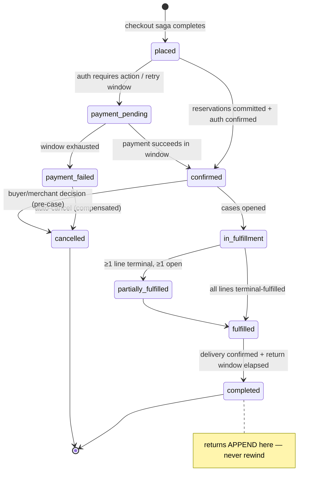

# DOF Commerce Foundation — ORDER_STATE_MACHINE

**Status:** Blueprint for Founder Review · v1.0 · 2026-07-25 · Conforms to ADR-007 §5 verbatim; this document adds the full transition table, guards, and the challenge record.

---

## 1. Challenging the naive list (why the brief's example states are wrong for DOF)

The brief proposed `Draft → Pending Payment → Authorized → Paid → Processing → Packed → Shipped → Delivered → Returned → Refunded → Cancelled`. Challenged, state by state:

| Proposed | Verdict | Why |
|---|---|---|
| Draft | **rejected** | A draft order is a cart. Cart ≠ Order is constitutional (A7-3/0.4); an order exists only after placement, immutable from birth (O1). |
| Pending Payment | **renamed** `payment_pending` | Exists, but as an *exception* interlude between placed and confirmed (retry window), not the happy path — authorization happens inside checkout, before the order is written. |
| Authorized / Paid | **rejected as order states** | Money states belong to the PaymentIntent (ADR-008 §4). The order records payment *facts* in its timeline; collapsing money into order state forbids partial capture and multi-leg tenders. |
| Processing / Packed | **rejected as order states** | Physical workflow belongs to Operations' FulfillmentCase. The order observes `in_fulfillment`; "packed" is a case fact appended to the timeline, not an order state — otherwise every Operations workflow change becomes an Orders migration. |
| Shipped / Delivered | **absorbed into line states + `fulfilled`** | With split shipment as first-class (A7-4), "shipped" is per-line, not per-order. `partially_fulfilled` says it honestly. |
| Returned / Refunded | **rejected as states** | Returns append to `completed`; they never rewind (ADR-007 R-f law). A returned order still *happened*. Refunds are Payments facts in the timeline. |
| Cancelled | **kept** | Reachable order-wide before cases open; per-line afterwards. |

The result is a machine with **six happy-path states, two exception states, one terminal decision** — everything else is line states and timeline facts.

## 2. Order states (frozen set)

## 3. Transition table (guards · evidence · events)

| From → To | Guard (specification) | Evidence appended (O3) | Emits |
|---|---|---|---|
| — → `placed` | saga step ledger = `placed`; snapshots frozen; unique(attempt key) | attempt record | `orders.order.placed` |
| `placed` → `confirmed` | every line's `CommitReservation` succeeded; auth confirmed | reservation commit ids; auth fact | `orders.order.confirmed` (**the first-sale Signature Moment trigger, A7-9**) |
| `placed` → `payment_pending` | auth `requires_action` or first capture-eligible failure | intent fact | *(internal; buyer-visible copy)* |
| `payment_pending` → `payment_failed` | retry window (24h) exhausted or terminal decline | intent facts | `orders.order.payment_failed` |
| `payment_failed` → `cancelled` | automatic; grace elapsed | compensation record (reservations released, auth voided) | `orders.order.cancelled` |
| `confirmed` → `in_fulfillment` | `OpenFulfillmentCase` acknowledged per (location, method) group | case ids | `orders.order.fulfillment_requested` |
| `in_fulfillment` → `partially_fulfilled` | `LinesResolved` partial | consumed `fulfillment.*`/`shipment.*` event ids | `orders.order.partially_fulfilled` |
| → `fulfilled` | all lines terminal-fulfilled | last fulfilling event id | `orders.order.fulfilled` |
| `fulfilled` → `completed` | CompletionPolicy: delivered + return window elapsed; or service confirmed / digital granted | policy record | `orders.order.completed` |
| `confirmed` → `cancelled` (whole) | `CanCancel`: no cases opened | decision record (actor, reason) | `orders.order.cancelled` |
| any post-case | **per-line only**, merchant-approved | decision + case amendment ref | `orders.order.cancelled` (scoped payload) |
| return resolution lands | `completed` unchanged; timeline appends | `operations.return.resolved` id → refund facts | `orders.order.returned` |

## 4. Line states (where the physical truth lives)

`open → reserved → committed → in_fulfillment → fulfilled | cancelled | returned` — plus reserved-but-unbuilt `awaiting_stock` (backorder) and `awaiting_release` (pre-order), named in ADR-007 0.6 so their arrival is additive.

Line-state rules: a line advances only on evidence (commit result, case events); digital/service lines may reach `fulfilled` instantly at grant (a whole-digital order can go `confirmed → fulfilled` in seconds — the machine permits skipping `in_fulfillment` only when every line skips it); `returned` is terminal *per line* and coexists with order `completed`.

## 5. Tolerances (what the machine must survive)

- **Late facts:** a `shipment.delivered` arriving after `completed` (clock skew, carrier lag) appends to the timeline idempotently; no state change, no error.
- **Out-of-order facts:** timeline orders by occurred-at + source sequence; state transitions re-derive from the full fact set, so `delivered` before `in_transit` cannot corrupt state.
- **Duplicate facts:** delivery-ledgered consumers; appending the same event id twice is a no-op.
- **Conflicting decisions:** cancellation racing fulfillment resolves by case state at Operations (the case either amends or declines); the order records whichever decision won, with both attempts in the timeline.

## 6. Read models (the two projections)

**Merchant needs-action list:** orders in `confirmed` without opened cases, cancellation requests pending, return decisions pending — each row is a Pulse task with certainty (A7-8). **Buyer timeline:** the order's own timeline projected in buyer language with per-line honesty ("2 of 3 shipped"), lagging reality by at most one event-hop and saying so (narrated waiting, UX-BIBLE §6.3).
